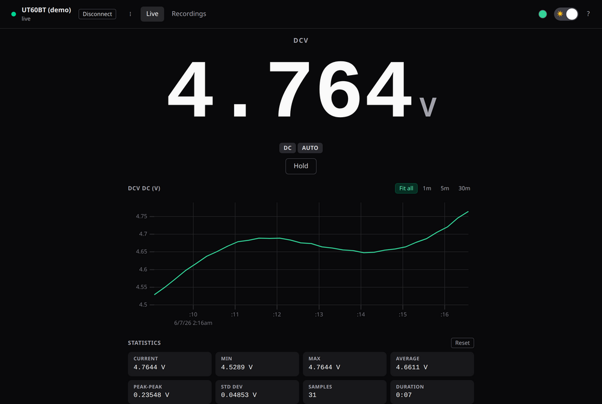
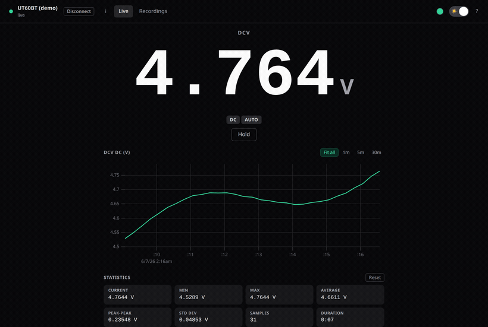
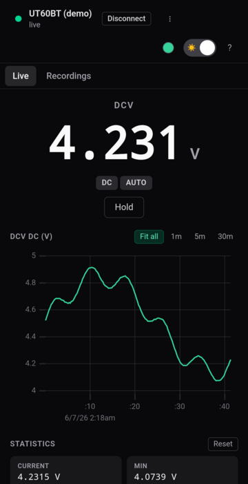
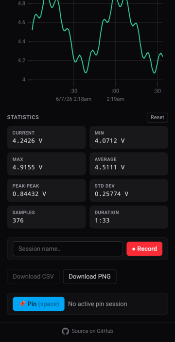
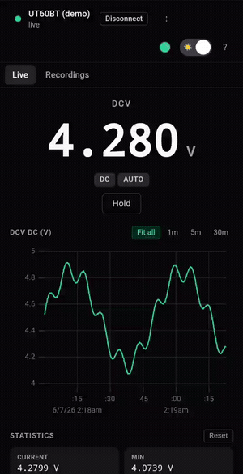
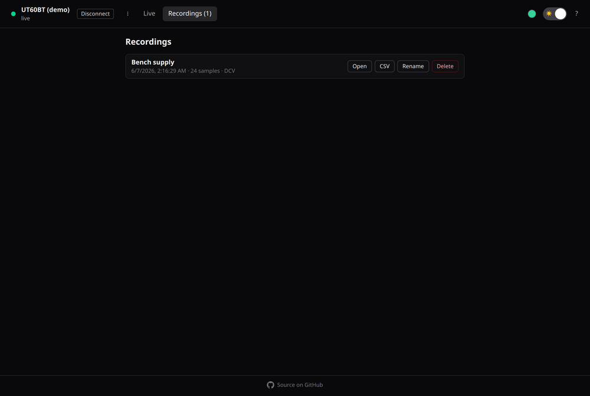
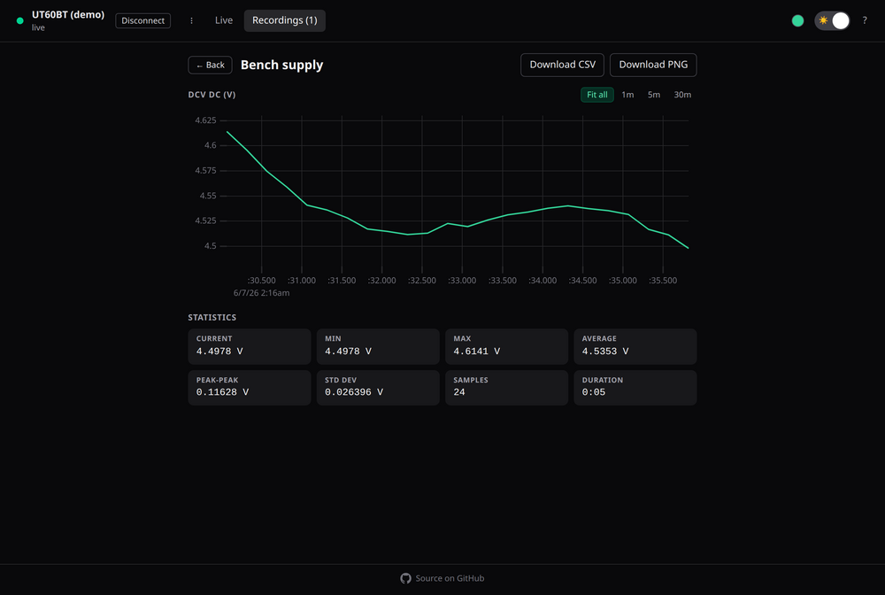

# Multimeter

A browser companion for the **UNI-T UT60BT** Bluetooth multimeter: a live, full-screen
readout with charting, statistics, recording, and CSV/PNG export. It runs entirely in your
browser over [Web Bluetooth](https://developer.mozilla.org/docs/Web/API/Web_Bluetooth_API) —
no install, no account, no data leaves your machine — and installs as an offline PWA.

**▶︎ [Open the app](https://mbtech-nl.github.io/multimeter/)** &nbsp;·&nbsp;
[Try the demo](https://mbtech-nl.github.io/multimeter/?demo) (no meter needed)

<p align="center">
  
</p>

## Features

- **Live readout** — a big, glanceable hero value with function, AC/DC, and range badges.
- **Charting** — a rolling live chart (uPlot) with Fit-all / 1m / 5m / 30m windows; range
  changes (kΩ↔MΩ) stay continuous because values are normalized to SI.
- **Statistics** — current, min, max, average, peak-to-peak, std-dev, sample count, duration.
- **Recording** — capture sessions to IndexedDB; they survive a reload. Pause / resume / stop.
- **Export** — download any session as **CSV**, or the chart as a **PNG**.
- **Hold & Pin** — freeze the readout, or pin a value to read hands-free while the stream runs.
- **All UT60BT functions** — V / A / Ω, continuity, diode, capacitance, frequency, duty %,
  temperature, and NCV.
- **PWA** — installable, works offline, light/dark theme that also drives the system UI bars.
- **Keyboard-driven & accessible** — full shortcut set and a screen-reader announce key.

## Screenshots

<p align="center">
  
</p>

<p align="center">
  
  &nbsp;&nbsp;
  
  &nbsp;&nbsp;
  
</p>

<p align="center">
  
  
</p>

## Requirements

Web Bluetooth is required, which means a **Chromium-based browser** in a secure context
(HTTPS or `localhost`):

| Platform | Works | Notes |
| --- | --- | --- |
| Chrome / Edge / Brave / Opera (desktop) | ✅ | Linux, macOS, Windows, ChromeOS |
| Chrome (Android) | ✅ | Connect the meter directly from the phone |
| Firefox / Safari | ❌ | No Web Bluetooth |
| iOS / iPadOS | ❌ | No Web Bluetooth (works only via a WebBLE browser like Bluefy) |

Power on the meter, then click **Connect** and choose it in the browser's device chooser.

## Getting started

```bash
npm install
npm run dev      # Vite dev server (also exposed on the LAN for phone testing)
npm run build    # type-check + production build
npm test         # unit tests (vitest)
```

> **No meter handy?** Append `?demo` to the URL (e.g. `localhost:5173/multimeter/?demo`)
> to drive the whole UI from a synthetic measurement stream — handy for development and the
> screenshots above.

## Keyboard shortcuts

| Key | Action | Key | Action |
| --- | --- | --- | --- |
| `c` | Connect / disconnect | `e` | Export CSV |
| `b` | Toggle backlight | `i` | Export chart PNG |
| `h` | Hold / release | `v` | Switch Live / Recordings |
| `Space` | Pin current reading | `s` | Announce reading (a11y) |
| `r` | Start / stop recording | `t` | Toggle light / dark |
| `p` | Pause / resume recording | `?` | Show this help |

## How it works

The UT60BT speaks a simple BLE protocol: the app subscribes to a notify characteristic,
runs the meter's handshake, and decodes each 19-byte measurement frame into a reading
(function, value, unit, flags). The protocol was reverse-engineered from the device; decode
logic is pure and unit-tested against captured frames.

## Tech stack

React 19 · TypeScript · Vite · Tailwind CSS · uPlot · vite-plugin-pwa · Web Bluetooth · IndexedDB.

## License

[MIT](LICENSE)
